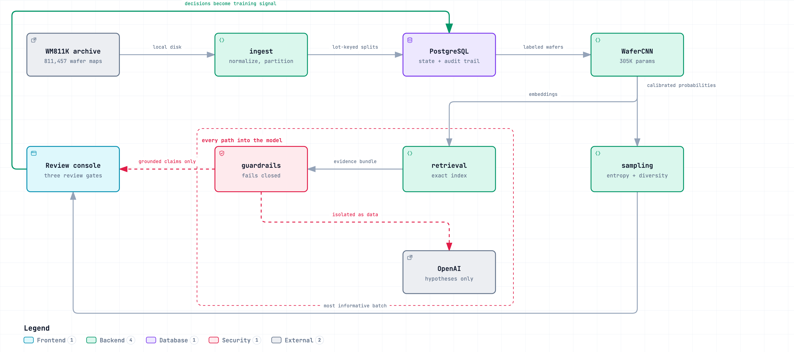
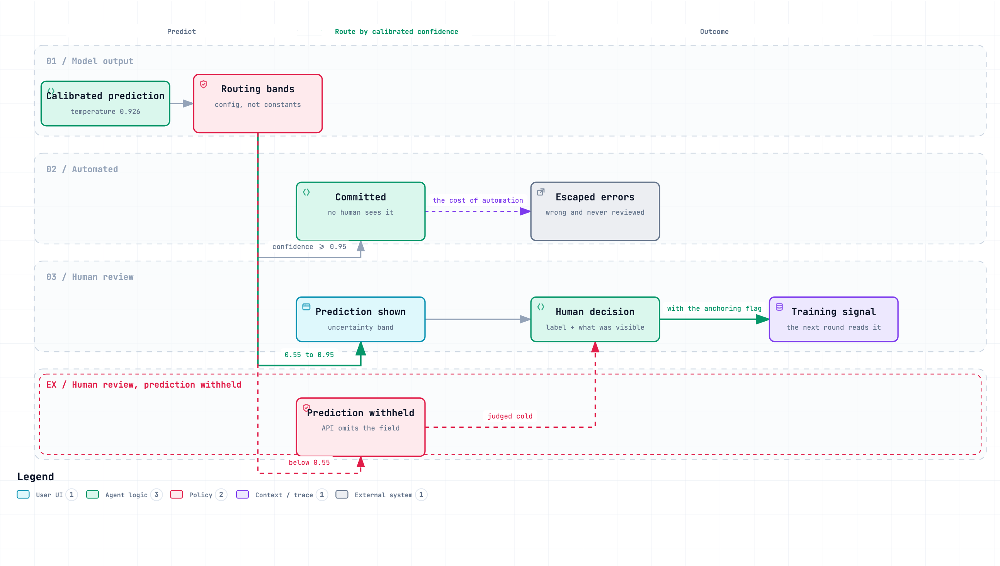
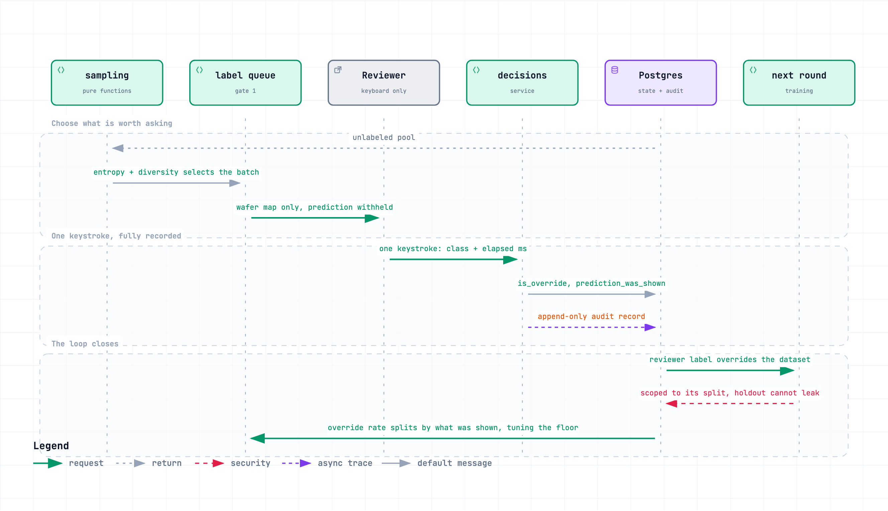
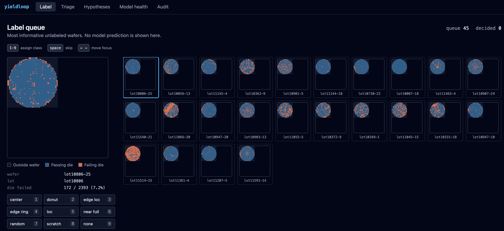
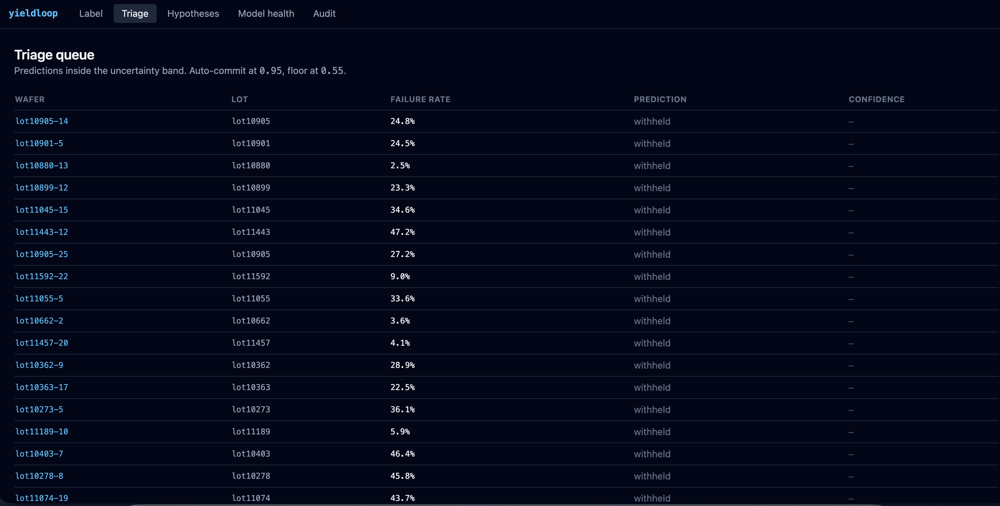
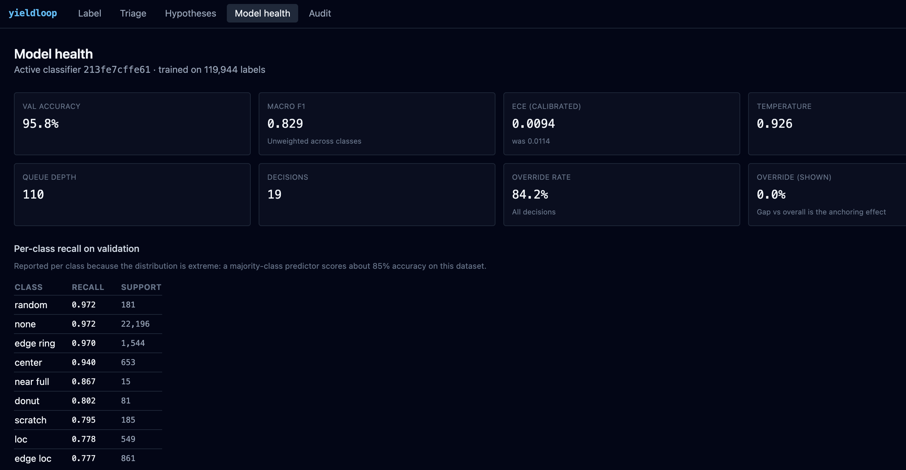
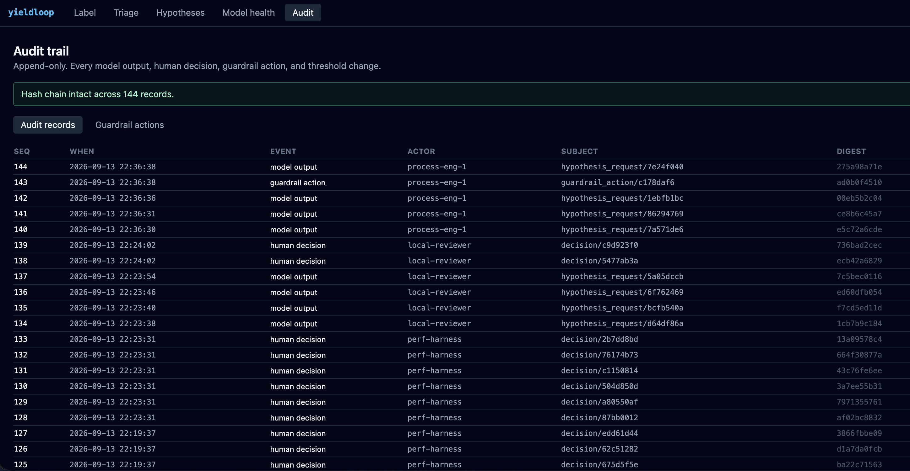
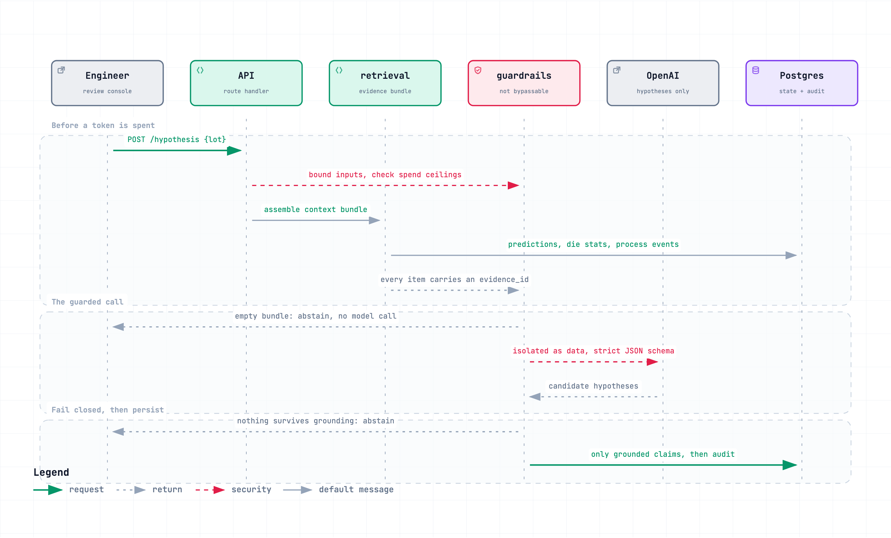

# yieldloop

**A wafer map defect triage console with a human decision loop, active learning, and a root cause agent that cannot cite evidence it was not given.**

Classifies 811,457 real wafer maps, commits the 87.75% it is confident about without a human, and routes the rest to a keyboard-first review console — hiding its own guess on the cases where showing it would anchor the reviewer rather than help them. Every decision returns as training signal.

[](docs/diagrams/yieldloop-architecture.html)

_All four system diagrams on one page: [`docs/diagrams/index.html`](docs/diagrams/index.html) — architecture, routing bands, the human loop, and the guarded agent call._

| | Measured on 26,741 held-out wafers |
| --- | --- |
| Accuracy | **96.36%** against an 86.38% majority-class baseline |
| Macro F1 | **0.8307** against 0.1030 |
| Committed without a human | **87.75%**, with 0.44% escaped errors |
| Labels to reach macro F1 0.60 | **8,000** with active learning; random had not reached it by 16,000 |
| Fabricated citations from the agent | **0** |
| Tests | **384 backend + 19 Playwright**, no mocks, all against real infrastructure |

> **Data:** this repository contains no dataset. It reads the real
> [WM811K wafer map dataset](https://www.kaggle.com/datasets/qingyi/wm811k-wafer-map)
> (2 GB), fetched to `data/` by `scripts/fetch_dataset.py` and verified by sha256 on
> every load. There is no generated fallback.

---

## The problem

A semiconductor fab produces wafer maps by the hundred thousand. Each is a grid
showing which die passed electrical test and which failed. When failures form a
*pattern* — a ring at the edge, a scratch across the middle, a cluster in one
corner — that pattern points at a cause: a handling fault, a chamber drift, a
recipe change upstream.

Three things make this expensive:

**There are far too many to look at.** WM811K, the real dataset this runs on,
holds 811,457 wafers. A process engineer cannot review them, so most are never
examined and real excursions are found late.

**Labels are the bottleneck, not data.** Of those 811,457 wafers, **638,507
(78.7%) have no human label at all.** Wafer maps are cheap; expert attention is
not. Any system that needs a lot of labeled examples is asking for the one
resource the fab cannot spare.

**The classes that matter are the rare ones.** 85% of labeled wafers are `none`
— no pattern. `near_full` is 149 wafers out of 811,457. A model that predicts
"no pattern" unconditionally scores 85% accuracy and is worthless, which is why
accuracy alone is never reported here.

### What yieldloop does about it

1. **Classifies** every wafer map into one of nine defect patterns, with a
   *calibrated* confidence — one that means what it says.
2. **Routes** by that confidence: commit the confident ones automatically, send
   the ambiguous ones to a human, and for the least confident ones send them to a
   human **with the model's guess hidden**, so the engineer is not anchored.
3. **Asks the human only about wafers worth asking about**, using active
   learning to pick the most informative unlabeled wafers instead of a random
   sample.
4. **Captures every decision as training signal**, including what the reviewer
   could see when they made it.
5. **Explains flagged lots** with ranked root cause hypotheses that must cite
   retrieved evidence or explicitly abstain.

### What it measured

At the configured thresholds, on 26,741 held-out wafers from lots the model has
never seen:

| | Result |
| --- | --- |
| Wafers committed without a human | **87.8%** |
| Errors that escaped review | **0.44%** |
| Labels needed to reach macro F1 0.60 | **8,000** with active learning; random sampling had not reached it by 16,000 |
| Hypotheses citing evidence that did not exist | **0** |

---

## How it fits together

[](docs/diagrams/yieldloop-architecture.html)

_Interactive version: [`docs/diagrams/yieldloop-architecture.html`](docs/diagrams/yieldloop-architecture.html) — themes, pan/zoom, search, relationship tracing. Source spec: [`yieldloop-architecture.json`](docs/diagrams/yieldloop-architecture.json)._

Three things this makes visible that a file listing does not. The classifier and
the LLM are **separate paths** — no wafer map ever reaches OpenAI. The guardrails
sit between retrieval and the model on **both** sides, so there is no edge into
the LLM that skips them. And the console's arrow back into Postgres is not
bookkeeping: it is the loop closing, because those decisions are what the next
training round reads.

---

## How to run it

### Prerequisites

Docker, Python 3.12, Node 22, a Kaggle account, and optionally an OpenAI API key.

### 1. Configure

```bash
cp .env.example .env
```

Every tunable lives in `.env`, including the routing thresholds. Nothing is
hardcoded, which is what lets the eval harness sweep them.

### 2. Start Postgres and migrate

```bash
docker compose up -d postgres
docker compose run --rm migrate
```

### 3. Get the real dataset

```bash
python scripts/fetch_dataset.py
```

Needs `~/.kaggle/kaggle.json` (Kaggle → Settings → API → Create New API Token)
and one-time acceptance of the dataset terms in a browser. **There is no
generated fallback.** Without credentials it prints setup instructions and exits
non-zero, because a fallback is how a repository ends up publishing metrics
computed against something that is not the dataset. The script prints a sha256 —
put it in `YIELDLOOP_WM811K_SHA256` and every subsequent load is verified.

### 4. Load it

```bash
python scripts/bootstrap_db.py          # ~3 min: 46,293 lots, 811,457 wafers
```

Normalizes every map to a 64×64 grid and assigns each lot to train/validation/
holdout. Idempotent — re-running truncates and reloads.

### 5. Train

```bash
python -m scripts.train                 # ~80 min on Apple Silicon
```

Trains, fits calibration, and registers the artifact. Use `--train-limit N` for
a faster run.

### 6. Build the retrieval corpus

```bash
python scripts/seed_from_real_labels.py --max-lots 5000     # ~15 s
```

### 7. Fill the review queues

```bash
python scripts/run_active_round.py --strategy entropy_diversity --batch-size 64
python scripts/route_predictions.py
```

The first feeds the **label gate** — the most informative unlabeled wafers. The
second is the production path: it routes existing predictions, auto-committing
the confident ones and queuing the rest to the **confirm gate**, and escalating
lots with several confident non-`none` predictions to the **escalation gate**.

### 8. Run the console

```bash
docker compose up api frontend
```

Console at http://localhost:5173, API docs at http://localhost:8000/docs.

### Evaluate

```bash
python -m eval.harness --report eval_report.md     # all suites
python -m eval.harness --suite guardrail           # no DB, dataset, or key needed
python -m scripts.run_label_efficiency             # ~36 min, the second chart
python -m scripts.export_case_study --skip-agent
```

---

## The human loop

The name is literal. Three gates, and the loop closes.

**Gate 1 — Label.** Active learning picks the most informative unlabeled wafers.
No prediction is shown at any confidence: the point is an independent human
label, and showing a guess would turn it into agreement with the model.
Fed by `run_active_round.py`.

**Gate 2 — Confirm.** Predictions below the auto-commit threshold go to a human.
Inside the uncertainty band the prediction is shown; below the confidence floor
it is **withheld**, and the API omits the fields rather than the client hiding
them. Fed by `route_predictions.py`, which also auto-commits everything above
the threshold — expressed by producing no task at all.

**Gate 3 — Escalation.** Lots with several confident non-`none` predictions get
ranked root cause hypotheses with inline evidence. One odd wafer is noise; a
pattern across a lot is a lot-level cause worth asking about.

[](docs/diagrams/yieldloop-routing-bands.html)

_Interactive version: [`docs/diagrams/yieldloop-routing-bands.html`](docs/diagrams/yieldloop-routing-bands.html) — themes, pan/zoom, search, relationship tracing. Source spec: [`yieldloop-routing-bands.json`](docs/diagrams/yieldloop-routing-bands.json)._

**And the loop closes.** Every decision is written back as training signal: a
reviewer label overrides the dataset's own annotation for that wafer, a reviewer
label on a previously-unlabeled wafer becomes a new training example, and a
reviewed wafer leaves the unlabeled pool so the sampler stops offering it.
Reviewer labels are scoped to their split, so a decision on a holdout wafer can
never reach training. Each artifact records how many of its labels came from the
console, so a human-corrected model is distinguishable from one trained only on
WM811K.

Decisions also record **what the reviewer could see**, which is what makes the
anchoring effect measurable rather than assumed.

[](docs/diagrams/yieldloop-human-loop.html)

_Interactive version: [`docs/diagrams/yieldloop-human-loop.html`](docs/diagrams/yieldloop-human-loop.html) — themes, pan/zoom, search, relationship tracing. Source spec: [`yieldloop-human-loop.json`](docs/diagrams/yieldloop-human-loop.json)._

## The console



Six screens. The three that carry the product:

**LabelGrid** — the label gate. Built first and optimized for keyboard-only
operation: a digit key both labels the focused wafer and advances, so a decision
is one keystroke. Wafer maps render on canvas from the real arrays. **No model
prediction appears here at any confidence** — the point of this gate is an
independent human label, and showing a guess would turn it into agreement with
the model.

**TriageQueue / WaferDetail** — the confirm gate. Uncertainty-band predictions
with their calibrated confidence shown against the configured thresholds. Below
the confidence floor the prediction is **absent from the API response**, not
hidden by the client, and the row says "withheld" so the reviewer knows the model
has an opinion being deliberately held back.

**HypothesisCard** — the escalation gate. Ranked root cause hypotheses, each
claim rendering its evidence as a clickable citation. Abstention renders as
"insufficient evidence" with the reason, never as an empty card.

Plus **ModelHealth** (calibration, override rates, per-class recall) and
**AuditTrail** (the append-only log with live hash-chain verification).

| | |
| --- | --- |
|  |  |
| Triage queue — every row says **withheld**, because these fell below the confidence floor and the API omits the fields entirely | Model health — calibration before and after, and override rate reported twice so the anchoring effect is visible |



The audit trail, with its hash chain verified live. `UPDATE`, `DELETE` and
`TRUNCATE` are revoked on this table and a trigger raises regardless of
privilege, so the chain is the last line rather than the first.

---

## The ML model

A small convolutional network — **305,129 parameters**, trained from scratch on
this dataset. Deliberately small: the defect patterns are spatial signatures on a
64×64 grid, and a few convolutional blocks capture them. A larger backbone would
raise the ceiling slightly while making the parts that actually matter —
calibration, routing, the human loop — slower to iterate on.

Die values are **one-hot encoded into three channels**, not fed as integers.
WM811K encodes 0 as outside the wafer, 1 as a passing die, 2 as a failing die;
these are categorical, and feeding the raw integers would impose an ordering the
data does not have.

The network returns a **128-dimensional L2-normalized embedding** alongside its
logits. The same vector drives active learning diversity selection *and*
retrieval, so "similar wafer" means one thing in this system rather than two
things that share a name.

**Trained on** 119,944 labeled wafers, best epoch 19 of 23 (early stopped on
validation loss).

### Results on the holdout split

26,741 wafers, from lots the model has never seen — partitioning is keyed on the
lot, so no lot straddles a split.

| Metric | Model | Majority-class baseline |
| --- | --- | --- |
| Accuracy | **96.36%** | 86.38% |
| Macro F1 | **0.8307** | 0.1030 |
| Balanced accuracy | **87.35%** | 11.11% |

The baseline column is why accuracy is never quoted alone here.

| Class | Recall | Holdout support |
| --- | --- | --- |
| none | 0.976 | 23,098 |
| edge_ring | 0.954 | 1,315 |
| random | 0.948 | 153 |
| center | 0.931 | 662 |
| near_full | 0.900 | 30 |
| loc | 0.853 | 497 |
| scratch | 0.803 | 157 |
| edge_loc | 0.763 | 780 |
| donut | 0.735 | 49 |

### Calibration, and why it is load-bearing

Every routing decision compares a confidence against a threshold, so the
confidences have to mean something. A raw softmax is systematically overconfident;
setting an auto-commit threshold against uncalibrated scores commits a known
fraction of errors unreviewed while looking rigorous.

Temperature scaling fits **one scalar** on validation. One parameter is the
point: it cannot change which class is predicted, so accuracy is unchanged by
construction and any improvement is real.

| | Value |
| --- | --- |
| Fitted temperature | 0.9261 |
| Expected calibration error | 0.0097 → **0.0066** |
| Gap in the auto-commit band | **0.0030** over 23,465 predictions |

That last row is the one that bears on safety: among predictions confident enough
to commit without review, stated confidence and actual accuracy differ by 0.3
percentage points.

### Active learning

The label gate selects wafers by **entropy plus embedding diversity**. Entropy
alone selects redundantly — the most ambiguous wafers look alike, so a batch can
spend a whole review round on near-duplicates of one pattern. Greedy max-min
selection is the counterweight.

Measured against random sampling at matched label counts, both arms sharing
splits, seed and hyperparameters:

| Labels | Active | Random | Delta |
| --- | --- | --- | --- |
| 1,000 | 0.2516 | 0.2516 | +0.0000 |
| 2,000 | 0.3965 | 0.3000 | **+0.0965** |
| 4,000 | 0.4809 | 0.3856 | **+0.0953** |
| 8,000 | 0.6174 | 0.4966 | **+0.1208** |
| 16,000 | 0.7908 | 0.5891 | **+0.2017** |

The gap widens with budget. The active arm reaches **95% of full-data quality
from 13% of the labels**.

Two honest notes the report also carries: the arms are identical at 1,000 labels
*by construction* (active learning has no model to select with until it has
labels, so it starts from a random seed set), and random never reached the target
within 16,000 labels, so the saving is stated as a lower bound of 2× rather than
an exact ratio.

---

## What OpenAI is for

**Not classification.** The classifier is the local CNN above. No wafer map is
ever sent to OpenAI.

The API is used for exactly one thing: when a lot is flagged for excursion
review, an LLM reads a **context bundle assembled entirely from retrieval** and
produces ranked root cause hypotheses — each with a mechanism, a confidence,
citations, and concrete queries that would confirm or eliminate it.

The problem it solves is the one a classifier cannot: the classifier says *what*
the pattern is, and an engineer still has to work out *why*. That means
correlating this lot against similar historical lots and process events, which is
reading and cross-referencing — what an LLM is genuinely good at.

It is also where an LLM is dangerous. Asked for root causes, a model will produce
fluent, plausible, well-structured hypotheses whether or not it has evidence, and
an engineer cannot tell the two apart by reading them.

### The guardrails

`src/yieldloop/guardrails/` wraps every call on both sides. It is not optional
and no caller flag disables it — the transport client knows nothing about
grounding, budgets, or the breaker, which is what stops a future caller reaching
the model without them.

[](docs/diagrams/yieldloop-guarded-agent.html)

_Interactive version: [`docs/diagrams/yieldloop-guarded-agent.html`](docs/diagrams/yieldloop-guarded-agent.html) — themes, pan/zoom, search, relationship tracing. Source spec: [`yieldloop-guarded-agent.json`](docs/diagrams/yieldloop-guarded-agent.json)._

The ordering is the design. Validation and the budget check happen **before a
token is spent**. Isolation happens while the prompt is built, so untrusted text
never reaches the instruction layer. Parsing and grounding happen before anything
is persisted, so an ungrounded claim never becomes a database row. An empty
bundle abstains without calling the model at all — paying for a call that cannot
possibly be grounded is pure waste.

| Gate | What it does |
| --- | --- |
| `input_filter` | Bounds every input **before a token is spent** |
| `injection` | Isolates untrusted text structurally rather than stripping it |
| `schema_validator` | Strict parse, fails closed, no lenient path |
| `grounding` | Drops any hypothesis citing evidence not in the bundle |
| `thresholds` | The three routing bands, including hiding the prediction below the floor |
| `budget` | Per-request token caps, per-session and daily spend ceilings |
| `circuit_breaker` | Degrades to classifier-only mode rather than failing the page |
| `audit` | Append-only record of every output, decision, guardrail action, and threshold change |

**Grounding is the one that matters.** Every claim must cite an `evidence_id`
present in the bundle assembled for *that* request. An unresolvable citation is
not a formatting problem to repair — it is a fabrication, and the hypothesis
carrying it is dropped whole. Partial repair is explicitly not done: keeping a
claim after discarding its bad citation leaves a statement partly built on
something invented, with the surviving citations lending it unearned
credibility. If nothing survives, the system returns an **explicit abstention**.

**Injection defence is isolation, not sanitization.** Reviewer notes and
retrieved report text pass through unmodified inside a fenced block declared as
data, with the fence neutralized so it cannot be closed early. Stripping matched
substrings is evaded by obfuscation, corrupts legitimate prose — a reviewer
writing *"ignore the previous edge measurement"* means it literally — and
destroys the evidence that should reach the audit log.

**Measured on live calls:** 100% grounding rate, **0 fabricated citations**, and
an abstention rate that is deliberately *not* minimized — abstaining on a thin
bundle is correct, and a rate of zero against sparse evidence would mean the
model is inventing support.

**Cost is bounded and recorded.** Every call is written to a `cost_ledger` table
that the spend ceilings read, so the caps survive a restart and are shared across
workers. Total spend building and verifying this system: **$0.56 across 54
calls**.

---

## Other functionality

**Append-only audit trail.** `audit_records` has UPDATE, DELETE, and TRUNCATE
revoked *and* a trigger that raises regardless of privilege — the trigger is
necessary because the application connects as the table owner, and an owner
retains implicit rights it can re-grant itself. On top sits a hash chain, so
tampering by something that bypasses the application entirely is still
detectable. `GET /audit/verify` reports it live.

**Content-addressed model registry.** Every artifact records the hash of the
ordered wafer/label pairs it was fit on, the git commit, whether the tree was
dirty, the seed, and the hyperparameters. Any number in the eval report traces to
a run that can be repeated.

**Telemetry worker.** Computes override rate, calibration drift against the
training-time figure, and input distribution drift (population stability index
over the embeddings) on a schedule. It never changes behaviour — silently
retuning thresholds would mean the running configuration no longer matches
`threshold_changes`, and the audit trail would stop explaining the system.

**Anchoring measurement.** Every decision records whether the prediction was
visible, so override rate splits two ways. The gap between them is the anchoring
effect — if reviewers disagree far more when the prediction is hidden, visible
predictions are buying agreement rather than earning it, and the floor should
rise.

**Evaluation gate.** `eval/baselines.json` holds 18 committed metric floors.
CI fails a pull request on regression beyond tolerance.

---

## Data provenance

All wafer maps and defect labels are real WM811K data. Derived rows — process
events, historical excursions — carry a `derivation_rule` naming the
deterministic function that produced them, and the two tables that could be
mistaken for observed fab telemetry carry a non-nullable `is_derived` column with
a database check constraint pinning it true.

**No derived event names a tool, chamber, recipe, operator, or production
timestamp**, because the dataset contains none. The agent is therefore
structurally unable to cite one. Every derivation is specified in
[docs/data_contract.md](docs/data_contract.md).

One check worth noting: WM811K carries a `dieSize` field that is the die count
per wafer. The ingest layer's own counting reproduces it **exactly on 60,000 of
60,000 sampled wafers**, and that runs as a test — so a regression in counting or
normalization ordering breaks the build rather than quietly shifting every
failure rate in the system.

---

## Testing

**384 backend tests and 19 Playwright tests, 0 skipped, 0 failed** — including
the ones that need the real dataset, a real Postgres, and the live API. No mocks,
stubs, monkeypatching, or fake fixtures anywhere.

- Database tests start a **real Postgres container**
- Dataset tests read the **real 2 GB archive**
- OpenAI contract tests **call the live API** under a token cap
- Playwright drives the **real API and real database**, not a stubbed fetch layer
- Sampler, calibration, and drift invariants are **property-based** with Hypothesis

The single deliberate exception is a scripted transport in the guardrail
integration tests. It is not a mock of the guardrails — every guardrail runs for
real — it is a *controlled model*, because adversarial model behaviour cannot be
provoked on demand from a live API.

```bash
pytest                                  # everything
pytest -m "not openai and not dataset"  # fast loop
pytest -m openai                        # live API, bounded budget
cd frontend && npx playwright test      # needs the API running
```

---

## Documentation

| | |
| --- | --- |
| [Architecture](docs/architecture.md) | Layer ownership and the decisions that shaped it |
| [Data contract](docs/data_contract.md) | Every field and every derivation rule |
| [Guardrails](docs/guardrails.md) | Each gate, why it exists, what it refuses |
| [Evaluation](docs/evaluation.md) | Method, and why each metric is reported the way it is |
| [Runbook](docs/runbook.md) | Operating it, and what to do when something trips |
| [Diagrams](docs/diagrams/index.html) | All four system diagrams on one scrollable page |

---

## Stack

Python 3.12 · FastAPI · SQLAlchemy 2.0 · Alembic · Pydantic v2 · PyTorch · FAISS ·
OpenAI SDK · React 18 · TypeScript · Vite · Tailwind · Postgres · Docker Compose

Licensed Apache-2.0. WM811K carries its own terms, accepted on the Kaggle
dataset page.
